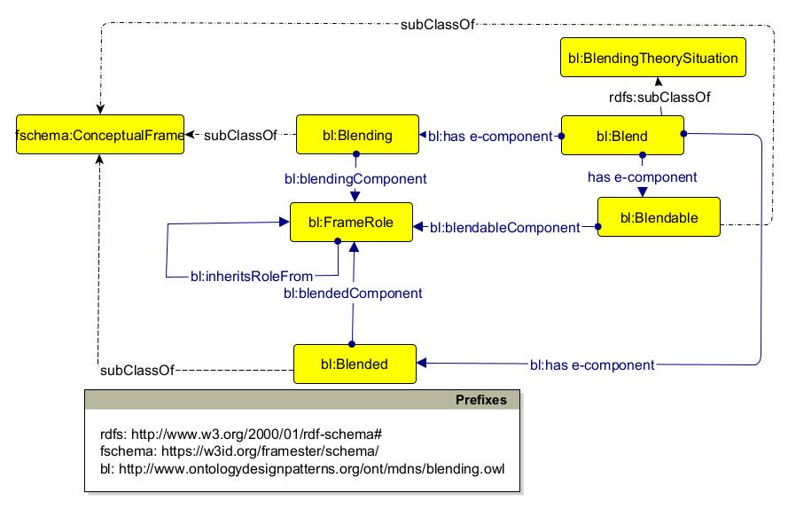

# A Knowledge Augmented Generation Approach to Enhance Multimodal Analogical Reasoning

This work  introduces a Knowledge-Augmented Generation (KAG) framework that combines knowledge graphs with Conceptual Blending-inspired prompts to capture implicit analogies. Applied to metaphor detection tasks, it outperforms baselines, enhances explainability, and even exceeds human performance in understanding visual metaphors.

## Table of Contents

- [Project Structure](#project-structure)
- [Data](#data)
- [Code](#code)
- [Contributing](#contributing)
- [License](#license)
- [Contact](#contact)

## Project Structure

├── data/ # Contains datasets or input files for the project │ ├── raw/ # Original/raw data files │ ├── processed/ # Processed or cleaned data │ └── README.md # Instructions or details about the data ├── code/ # Contains scripts or notebooks │ ├── src/ # Source code for the project │ ├── notebooks/ # Jupyter or other notebooks for analysis │ └── README.md # Details about the code structure ├── README.md # Overview of the project └── LICENSE # License file

## Data

The `data/` directory contains the following:

- `raw/`: This folder contains the original datasets.
- `processed/`: This folder contains processed or cleaned datasets, ready for analysis.
- `README.md`: A file with additional details or instructions on how to use the data files.

Ensure the data follows the expected format before running the code.

## Ontology

# Core Blending Ontology

For full information, it is possible to visit [this link](http://www.ontologydesignpatterns.org/ont/mdns/blending.owl).

## Code

The `code/` directory contains:

- `src/`: Core source code for the project, including scripts, modules, and functions.
- `notebooks/`: Jupyter or similar notebooks that contain exploratory data analysis, visualizations, or experiments.

Please follow the instructions in the `README.md` file inside the `code/` directory to understand the code structure and how to run it.

